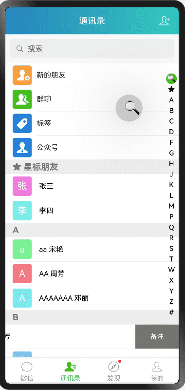
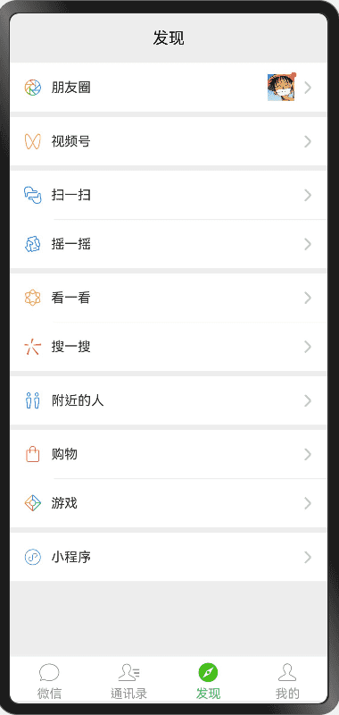
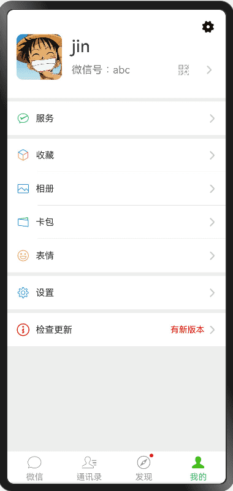

# JhHarmonyDemo

A new Harmony NEXT project - 实现一些常用效果、封装通用组件和工具类 <br>
<br>

pwd：123456

代码不定期更新
<br>
<br>

## 项目运行环境

* About HarmonyOS SDK
    * HarmonyOS 5.0.1 Release SDK, inclusion of OpenHarmony SDK Ohos_sdk_public 5.0.1.115 (API Version 13 Release) as is.

* About DevEco Studio
    * DevEco Studio 5.0.1 Release
    * Build Version: 5.0.5.310, built on December 13, 2024

## 实现的一些效果

* 通用框架搭建、通用基类实现
* 工具类module实现
* 字体、颜色、字符串等宏定义
* axios网络请求封装
* API接口管理和数据管理
* 组件
    * BaseNavigation、BaseTabBar
    * 弹框(中间、底部、toast、dialog、自定义弹框)
    * 单列、多列、底部选择器
    * JhForm 表单录入(单行输入样式、选择样式、登录样式、设置样式)
* 工具类
    * AES加解密、MD5加密、Base64编码解码
    * 本地数据AES加密存储
* UI相关
    * ListView相关
    * 登录注册
    * 仿微信UI（首页，通讯录，发现和个人中心等）
    * 仿微信右上角弹框

注：

* 封装的组件和工具类都在`JhCommon` module中
* 更多请下载工程查看

<br>

## 使用到的三方库

| 库                                                                                      | 功能                  |
|----------------------------------------------------------------------------------------|---------------------|
| [@ohos/axios](https://ohpm.openharmony.cn/#/cn/detail/@ohos%2Faxios)                   | **网络库**             |
| [@ohos/crypto-js](https://ohpm.openharmony.cn/#/cn/detail/@ohos%2Fcrypto-js)           | **加密算法**            |
| [@pura/harmony-utils](https://ohpm.openharmony.cn/#/cn/detail/@pura%2Fharmony-utils)   | **常用工具类**           |
| [@jxt/xt_hud](https://ohpm.openharmony.cn/#/cn/detail/@jxt%2Fxt_hud)                   | **Toast和Loading弹框** |
| [pinyin-pro](https://ohpm.openharmony.cn/#/cn/detail/pinyin-pro)                       | **专业的拼音转换工具**       |
| [@pura/harmony-dialog](https://ohpm.openharmony.cn/#/cn/detail/@pura%2Fharmony-dialog) | **一款极为简单易用的零侵入弹窗**  |

## 赞赏支持

* 如果您觉得还不错，或者我的开源项目对您有所帮助，可以点右上角“Star”支持一下，您的支持就是我的动力，谢谢🙂
* 您也可以扫描下面的二维码，请作者喝杯奶茶 🧋

<br>


<br>

## 预览

部分页面效果如下：


<br>
<br>
<br>

|                  |            |         |
|:---------------------------------------------------------------------------------------------------------------------:|:--------------------------------------------------------------------------------------------------------------------:|:---------------------------------------------------------------------------------------------------------------------:|
|         |            |    |
|  |  |  |
|         |   |          | 
|         |    |                                                                                                                  |
|                                                                                                                  |                                                                                                                 |                                                                                                                  |

<br>
<br>
<br>

## 微信UI：

|  |  |  |  |
|:--------------------------------:|:------------------------------------:|:------------------------------------:|:--------------------------------:|
|                           |                               |                               |                           |

<br>

## <a id="Licenses"></a> 开源协议

<details open id="Licenses">
  <summary><strong>Licenses</strong></summary>

```

MIT License

Copyright (c) 2024 iotjin

Permission is hereby granted, free of charge, to any person obtaining a copy
of this software and associated documentation files (the "Software"), to deal
in the Software without restriction, including without limitation the rights
to use, copy, modify, merge, publish, distribute, sublicense, and/or sell
copies of the Software, and to permit persons to whom the Software is
furnished to do so, subject to the following conditions:

The above copyright notice and this permission notice shall be included in all
copies or substantial portions of the Software.

THE SOFTWARE IS PROVIDED "AS IS", WITHOUT WARRANTY OF ANY KIND, EXPRESS OR
IMPLIED, INCLUDING BUT NOT LIMITED TO THE WARRANTIES OF MERCHANTABILITY,
FITNESS FOR A PARTICULAR PURPOSE AND NONINFRINGEMENT. IN NO EVENT SHALL THE
AUTHORS OR COPYRIGHT HOLDERS BE LIABLE FOR ANY CLAIM, DAMAGES OR OTHER
LIABILITY, WHETHER IN AN ACTION OF CONTRACT, TORT OR OTHERWISE, ARISING FROM,
OUT OF OR IN CONNECTION WITH THE SOFTWARE OR THE USE OR OTHER DEALINGS IN THE
SOFTWARE.

```

</details>